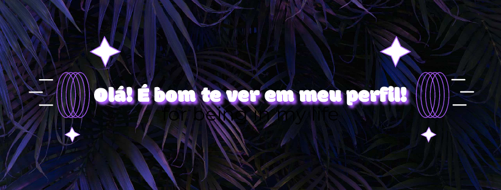

<!-- APRESENTAÇÃO -->

<!-- APRESENTAÇÃO -->
## Eu sou a Beatriz, estudante de programação e entusiasta em tecnologia!
  
- 👀 Interessada em atuar como desenvolvedora de sistemas
- 🌱 Atualmente focando no estudo de front end development

 <!-- TABELA DE CONTRIBUIÇÕES --><!-- PAINEL DE TRABALHOS -->
 
 
  
   
   <a href="https://git.io/streak-stats">
 
   
  
   

 
  
 
 <!-- ESPECIALIZÇÕES --><!-- GIF --> 

 
 
 
 

 

   

   

 
  
 
 
 
 
 
 
 
   <!-- https://github.githubassets.com/images/mona-loading-dark.gif-->
   

 
   
  <!-- CONTATOS -->

 
 
      
   

  

 

  <!--Resumo-->
 

  
  <h2 width="60%">Mais Sobre Mim</h2>
   

    Meu interesse por programação começou em meados de 2021, após participar de uma palestra no Ensino Médio que despertou minha curiosidade pela área.
    Aos poucos fui estudando sobre conceitos simples, como HTML5, CSS3, Lógica de Programação, entre outros; até me dar conta de que Desenvolvimento Web é minha paixão.
      
    Hoje, faço faculdade de Análise e Desenvolvimento de Sistemas e estudo Desenvolvimento Fullstack, além de participar de projetos e eventos de tecnologia com o    
    intuito de aprofundar e desenvolver meus conhecimentos.  
   

  
 

 
  ##
 
 <!-- COBRINHA -->
 

 
 
 

 
 
 
 
